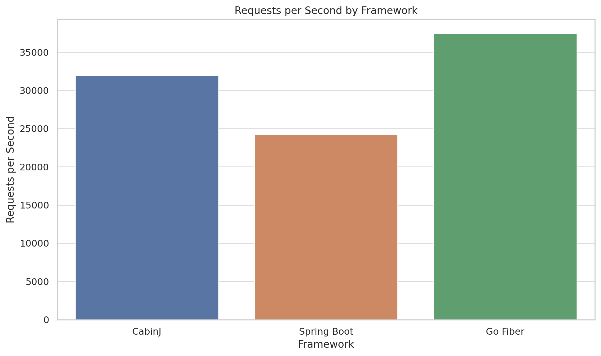
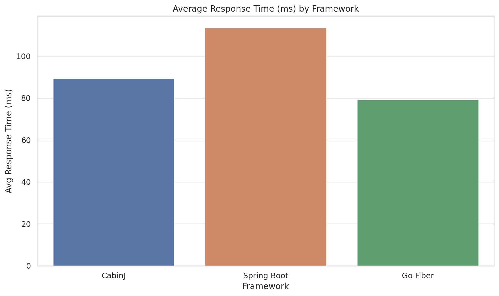
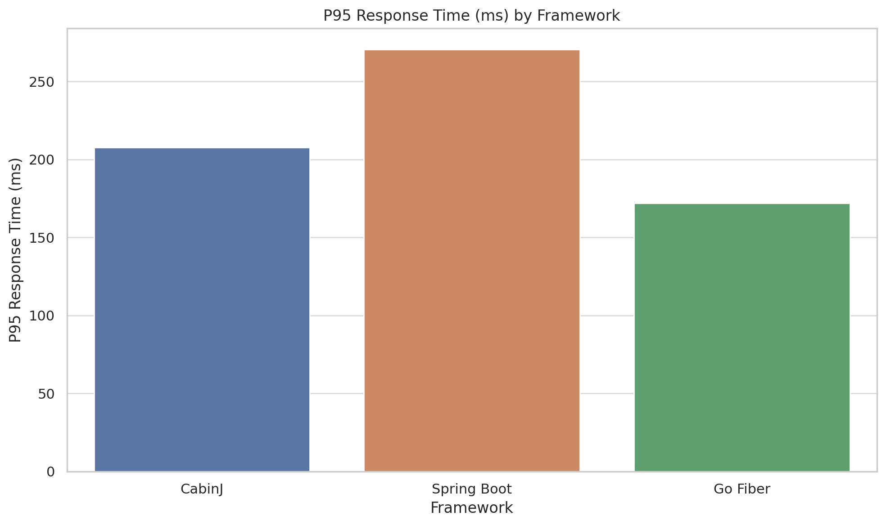
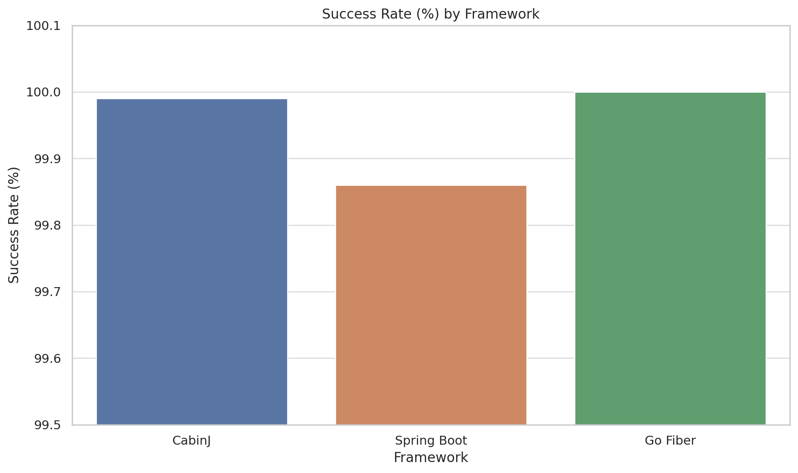

Use K6 for load testing a Java application with multiple endpoints and payloads.

# Benchmarking Java Application with k6

## 1. Plaintext
### Devices:
- **OS**: Macos 15
- **Device**: Apple M1 Pro 8-Core CPU - 16 GB RAM

### Frameworks comparison:








---

## 2. Benchmarking with multiple endpoints and payloads using k6
### Requirements

OS and Device:
- OS : Ubuntu 24.04.2 LTS
- Device: Intel® Core™ i7-9700K × 8 - 32 GB RAM

Setup:
- [k6](https://k6.io/docs/getting-started/installation/) installed on your machine.
- A Java application running on `http://localhost:8080` with the following endpoints:
  - GET `/`
  - GET `/health`
  - GET `/api/test`
  - GET `/api/data` (with dynamic keys)
  - GET `/static/test.txt`
  - GET `/static/small.json`
  - POST `/api/data/<key>` with JSON payloads.
- You can follow the [BenchmarkServer](src/test/java/com/cabin/express/benchmark/BenchmarkServer.java) example to set up the Java application.
- Ensure your Java application is running before executing the k6 script.
- The k6 script will simulate a load test with 3000 virtual users (VUs) across three scenarios: GET requests, POST requests, and a mixed scenario.
- The script will run for 1 minute and 5 seconds, with each scenario starting after a 5-second warmup period.

### Test results
```bash
 k6 run k6.js

  █ TOTAL RESULTS 

    checks_total.......................: 785529 22388.3948/s
    checks_succeeded...................: 99.84% 784276 out of 785529
    checks_failed......................: 0.15%  1253 out of 785529

    ✗ status is 2xx or 3xx
      ↳  99% — ✓ 784276 / ✗ 1253

    HTTP
    http_req_duration.......................................................: avg=95.01ms min=119.59µs med=80.41ms max=28.93s p(90)=151.01ms p(95)=202.53ms
      { expected_response:true }............................................: avg=95.02ms min=119.59µs med=80.41ms max=28.93s p(90)=151.03ms p(95)=202.64ms
    http_req_failed.........................................................: 0.15%  1253 out of 785529
    http_reqs...............................................................: 785529 22388.3948/s

    EXECUTION
    iteration_duration......................................................: avg=110ms   min=1.17ms   med=91.03ms max=30s    p(90)=170.91ms p(95)=222.56ms
    iterations..............................................................: 785529 22388.3948/s
    vus.....................................................................: 3000   min=0              max=3000
    vus_max.................................................................: 3000   min=3000           max=3000

    NETWORK
    data_received...........................................................: 4.1 GB 117 MB/s
    data_sent...............................................................: 94 MB  2.7 MB/s


running (0m35.1s), 0000/3000 VUs, 785529 complete and 0 interrupted iterations
get_main_100   ✓ [======================================] 1000 VUs  30s
mixed_main_100 ✓ [======================================] 1000 VUs  30s
post_main_100  ✓ [======================================] 1000 VUs  30s
```
---
### Script test.js

```js
import http from "k6/http";
import { check, sleep } from "k6";

/*
 * k6 Options: define three scenarios (GET, POST, MIXED) each with two stages:
 *  - a 5s warmup at 10 VUs,
 *  - followed by 30s at 100 VUs,
 *  - then 30s at 200 VUs.
 * Each scenario runs its dedicated function (exec) for the duration.
 */
export const options = {
  discardResponseBodies: true,

  scenarios: {
    // === GET REQUEST SCENARIO ===
    get_main_100: {
      executor: "constant-vus",
      exec: "getScenario",
      vus: 1000,
      duration: "30s",
      startTime: "5s", // after warmup
    },

    // === POST REQUEST SCENARIO ===
    post_main_100: {
      executor: "constant-vus",
      exec: "postScenario",
      vus: 1000,
      duration: "30s",
      startTime: "5s",
    },
    mixed_main_100: {
      executor: "constant-vus",
      exec: "mixedScenario",
      vus: 1000,
      duration: "30s",
      startTime: "5s",
    },
  },

  // Global thresholds (optional). You can adjust as needed.
  thresholds: {
    // 95% of all HTTP requests must complete in under 500ms
    http_req_duration: ["p(95)<500"],
    // Error rate (status >=400) should be below 5%
    http_req_failed: ["rate<0.05"],
  },
};

// Base URL; update if your server runs elsewhere
const BASE_URL = "http://localhost:8080";

// Array of endpoints for GET scenario (mirrors Java’s endpoints array)
const getEndpoints = [
  "/",
  "/health",
  "/api/test",
  "/api/data",
  // `/api/data/key_${n}` — generate dynamic in code
  "/static/test.txt",
  "/static/small.json",
];

// Array of payloads for POST scenario (mirrors Java’s payloads array)
const postPayloads = [
  JSON.stringify({ message: "hello" }),
  JSON.stringify({ data: "test data", id: Math.floor(Math.random() * 10000) }),
  JSON.stringify({ user: "testuser", action: "benchmark" }),
];

/*
 * Helper: Perform a single GET request against a random endpoint.
 * Tags each request with "get_req" so k6 can filter metrics if needed.
 */
function singleGet() {
  // Pick a random endpoint; if it’s "/api/data", append a random key
  let idx = Math.floor(Math.random() * getEndpoints.length);
  let endpoint = getEndpoints[idx];
  if (endpoint === "/api/data") {
    // 50% chance to append a key (simulate get specific key vs list all)
    if (Math.random() < 0.5) {
      endpoint = `/api/data/key_${Math.floor(Math.random() * 1000)}`;
    }
  }

  let res = http.get(`${BASE_URL}${endpoint}`, {
    tags: { request_type: "get_req" },
  });
  // Record success based on status code (200–399)
  check(res, {
    "status is 2xx or 3xx": (r) => r.status >= 200 && r.status < 400,
  });
}

/*
 * Helper: Perform a single POST request against /api/data/<random key>,
 * with a random JSON payload. Tag as "post_req".
 */
function singlePost() {
  let payload = postPayloads[Math.floor(Math.random() * postPayloads.length)];
  let key = `key_${Math.floor(Math.random() * 10000)}`;
  let res = http.post(`${BASE_URL}/api/data/${key}`, payload, {
    headers: { "Content-Type": "application/json" },
    tags: { request_type: "post_req" },
  });
  check(res, {
    "status is 2xx or 3xx": (r) => r.status >= 200 && r.status < 400,
  });
}

/*
 * GET‐only scenario: loop as fast as possible performing singleGet()
 */
export function getScenario() {
  singleGet();
  // Optional sleep to avoid hammering; set to 0 for maximum throughput
  // sleep(0.01);
}

/*
 * POST‐only scenario: loop as fast as possible performing singlePost()
 */
export function postScenario() {
  singlePost();
  // Optional sleep if desired:
  // sleep(0.01);
}

/*
 * Mixed scenario: on each iteration, choose GET (70%) or POST (30%)
 */
export function mixedScenario() {
  if (Math.random() < 0.7) {
    singleGet();
  } else {
    singlePost();
  }
  // Optional small sleep:
  // sleep(0.01);
}

```


To run the benchmark, save the above code in a file named `k6.js` and execute the following command in your terminal:
```bash
k6 run k6.js
```